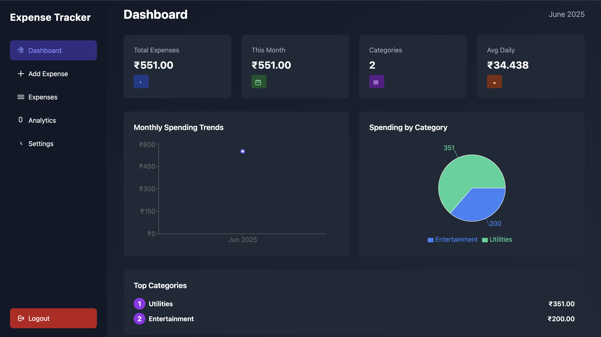
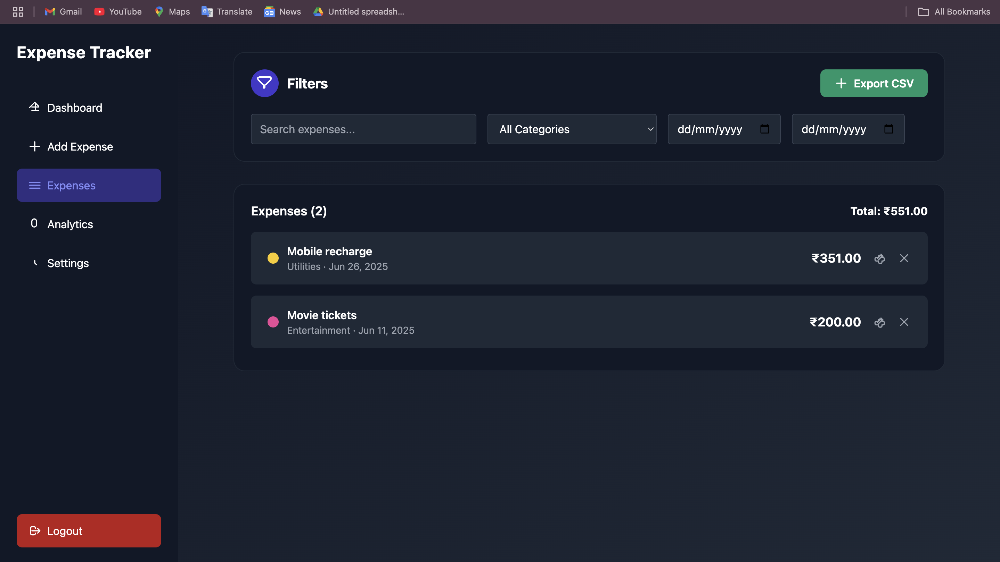
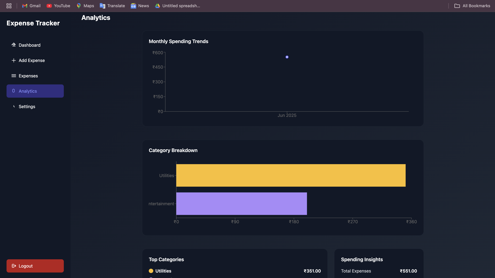
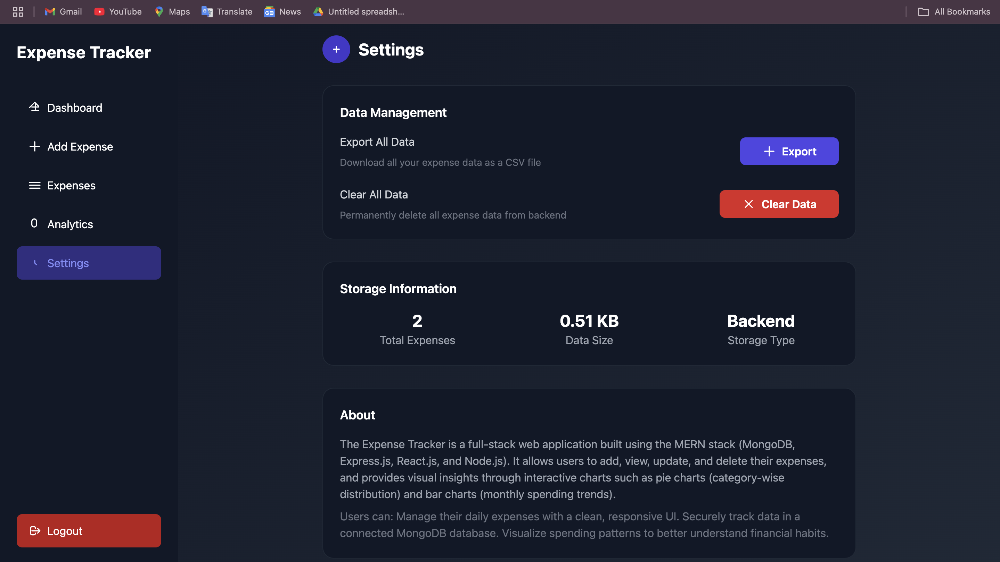

Expense Tracker

A full-stack Expense Tracker application with a modern dark UI, built using React (Vite, Tailwind CSS) for the frontend and Node.js/Express/MongoDB for the backend.

---

Snapshots


| Dashboard | Expenses | Analytics | Settings |
|-----------|----------|-----------|----------|
|  |  |  |  |

---

Setup Instructions

Prerequisites
- Node.js (v16+ recommended)
- MongoDB (local or cloud instance)

Add .env file in backend with required field
```bash
PORT = 
MONGO_URI = 
JWT_USER_PASSWORD = 
NODE_ENV =
```

1. Clone the repository
```bash
git clone <repo-url>
cd Expense_Tracker
```

2. Backend Setup
```bash
cd backend
npm install
npm run dev
```

3. Frontend Setup
```bash
cd ../frontend
npm install
npm run dev

```

4. Using the App
- Open [http://localhost:5173](http://localhost:5173) in your browser.
- Sign up, log in, and start tracking your expenses!

---

Architecture & Flow

Overview
- **Frontend:** Vite + React + Tailwind CSS, using `recharts` for charts.
- **Backend:** Node.js + Express, MongoDB for data storage.
- **Authentication:** Cookie-based sessions (with credentials included in fetch requests).

Folder Structure
```
Expense_Tracker/
  backend/      # Express API, MongoDB models, controllers, routes
  frontend/     # React app (Vite), Tailwind CSS, components, pages
```

Main Features
- **Authentication:** Signup/Login with session cookies.
- **Dashboard:** Stats, charts, and quick overview of expenses.
- **Expenses:** List, filter, search, edit, delete, and export expenses.
- **Analytics:** Visualize spending trends and categories.
- **Settings:** Export all data, clear all data, view storage info.

Data Flow
1. **User logs in** → Session cookie is set.
2. **Frontend fetches data** (expenses, stats) from backend using authenticated requests.
3. **User actions** (add, edit, delete, export) trigger API calls; UI updates accordingly.
4. **Charts and stats** update in real-time based on backend data.

Backend API Endpoints (examples)
- `POST /api/v1/user/signup` — Register new user
- `POST /api/v1/user/login` — Login
- `GET /api/v1/expense/all` — Get all expenses
- `POST /api/v1/expense/add` — Add expense
- `PUT /api/v1/expense/update/:id` — Update expense
- `DELETE /api/v1/expense/delete/:id` — Delete expense

---

Notes
- UI is fully responsive and dark-themed.
- developer - Nitesh Giri (https://www.linkedin.com/in/nitesh-giri/)
---